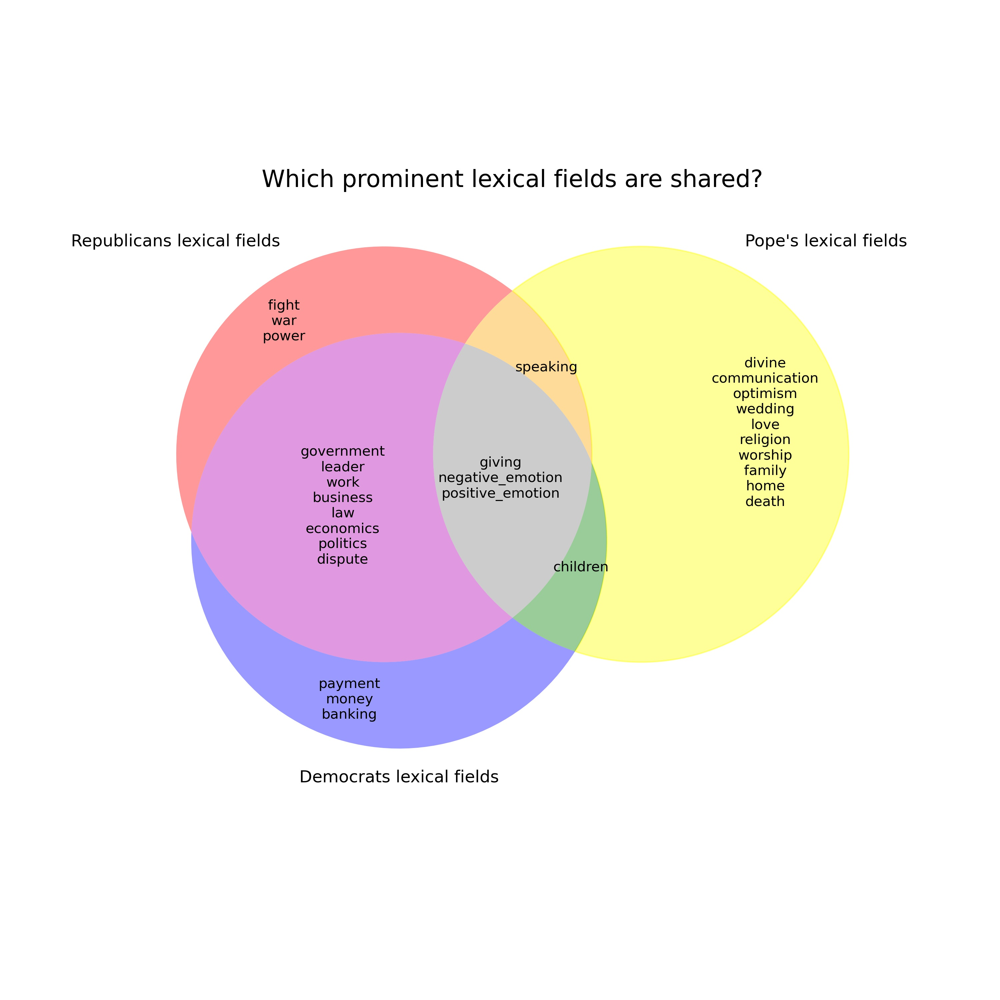

At first glance, one might think that the Pope does not have much impact on our everyday life and on our country’s politics, yet he influences over 1.3 billion Catholics worldwide and regularly meets with the most powerful political figures of the planet. Here, we want to investigate how one of the mightiest apolitical figures on Earth influences one sixth of the world population by using a novel quotations corpus : **Quotebank**. Our main approach consisted in placing the Pope on the binary American political spectrum by using characteristics extracted from his quotes. Our whole analysis goal consists in determining whether such an influential and, suposedly, non-political figure can be aligned with a certain political party or not.

## On what political spectrum can we try to place the Pope?
The political spectrum we choose to place the Pope on is the **American bipartite system** with on one end the Democratic Party and on the other the Republican Party. This spectrum is particularly suited to our analysis because the Quotebank corpus is in English and most of the quotes are extracted from American newspapers, thus a high number of quotations are from American politicians.  
This analysis is therefore divided into three groups: the **Democrates**, the **Republicans** and the **Pope**.  
Below is a summary table of the speakers chosen for each party.

| Political figure | Party      |Number of quotations |
|------------------|------------|----------------------|
| Elizabeth Warren | Democratic | 48'397               |
| Bernie Sanders   | Democratic | 84'018               |
| Hillary Clinton  | Democratic | 95'458               |
| Kamala Harris    | Democratic | 19'091               |
| Pete Buttigieg   | Democratic | 24'523              |
| Alexandria Ocasio-Cortez  | Democratic | 18'653     |
| Ted Cruz         | Republican| 46'301               |
| Mike Pence       | Republican| 46'893               |
| Mitt Romney      | Republican| 10'651               |
| Marco Rubio      | Republican| 41'650               |
| Ben Carson     | Republican| 22'448                 |
| Nikki Haley     | Republican| 24'533               |

## How do the Pope's quotes relate to those of the Democratic and Republican party? 
First, to investigate the Pope's position on the American political spectrum, it would be very meaningful to extract and analyse the most discussed topics by each party and by the Pope. A relevant way to do this is to study the most used lexical fields in the quotes of each speaker.  

### What lexical fields are used?
Let's first take a look at all the the lexical field categories that are used by each group.

We observe that the results are coherent for both political parties (with most frequent lexical fields such as governement, business, leader, politics, economics, law) but also for a religious figure such as the Pope (with divine, worship and religion).

### Do the lexical fields of the Pope correlate with those of the two parties?
Then, we further investigate the correlation in the use of lexical fields between each group.

The lexical fields between Republicans and Democrats are highly correlated (0.94). This seems consistent because even though the two parties approach issues differently and have different opinions, they both most likely use very political language. In contrast, the Pope's lexical fields correlate poorly with those of both political parties, but slightly more with those of the Republicans (0.45) than those of the Democrats (0.39).  



### What are the most shared topics between the groups?
We select the 15 most common lexical fields for all three categories and observe theirs relative use and importance


## Can we place the Pope on a political spectrum?
Partie sur la PCA
