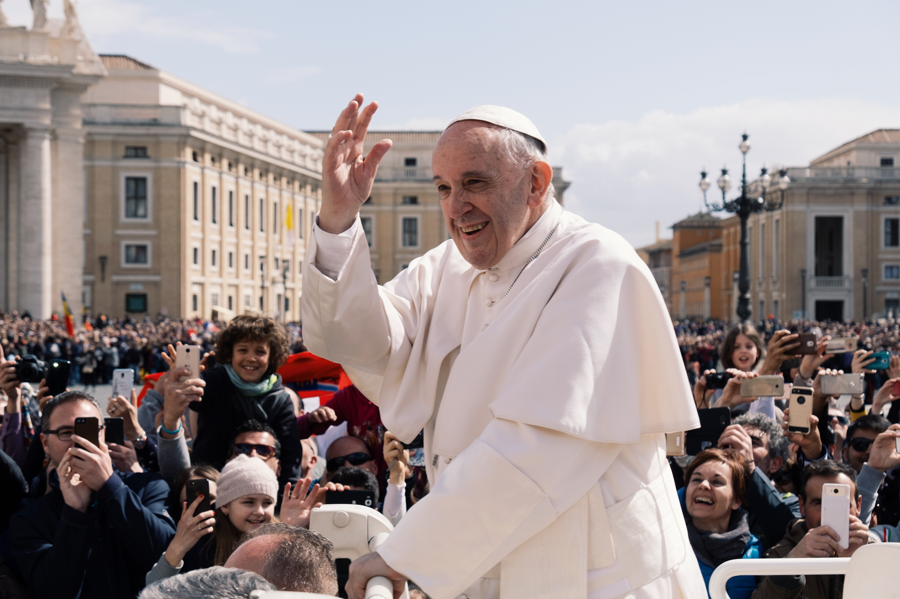

At first glance, one might think that the Pope does not have much impact on our everyday life and on our country’s politics, yet his opinion affects over 1.3 billion Catholics worldwide and regularly meets with the most powerful political figures of the planet. Here, we want to investigate how one of the mightiest apolitical figures on Earth influences one sixth of the world population by using a novel quotations corpus : **Quotebank**. 

  
Our main approach consists in placing the Pope on the American political spectrum, alongside to a few emblematic Democrates and Republicans politicians, by extracting meaningful features from the quote corpus of each of our selected speakers. More precisely, we focused on analysing how important key topics such as politics, economics, war and religion were to our speakers by looking at the prominent lexical fields present in their statements.
 
## Why the American political spectrum?

We chose to place the Pope on the **American bipartite political spectrum** which comprises at its two ends the Democratic Party and the Republican Party. This spectrum is particularly suited for our analysis, first, because the Quotebank corpus main language is English which means that a significant portion of the quotes originate from american politicians and secondly because choosing a binary spectrum simplifies our analysis a lot.
  
We divide our speakers into three categories: **Democrates**, **Republicans** and the **Pope**. Here we briefly summarize which speakers we chose to integrate into our analysis and how many quotes they pronouced along the Quotebank data sets between 2015 and 2020.

| Political figure | Party      |Number of quotations |     | Political figure | Party      |Number of quotations |  
|------------------|------------|----------------------|    |------------------|------------|----------------------| 
| Elizabeth Warren | Democratic | 48'397               |    | Kamala Harris    | Democratic | 19'091               | 
| Bernie Sanders   | Democratic | 84'018               |    | Pete Buttigieg   | Democratic | 24'523              | 
| Hillary Clinton  | Democratic | 95'458               |    | Alexandria Ocasio-Cortez  | Democratic | 18'653     | 
| Ted Cruz         | Republican| 46'301               |  | Marco Rubio      | Republican| 41'650               |
| Mike Pence       | Republican| 46'893               |  | Ben Carson     | Republican| 22'448                 |
| Mitt Romney      | Republican| 10'651               |  | Nikki Haley     | Republican| 24'533               |   
| Pope Francis        | Apolitical| 102'993            |
  
 
  

## What topics do they like to talk about? 
  
We begin our investigation by looking at how our three categories of speakers choose their words and what topics they fancy talking about the most. To do so, we analyzed the prevalence, summarized by a mean score, of 200 distinct lexical fields within the quotation corpus of our three categories:

Those first results are coherent as they show that our two political categories often talk about 

We observe that the results are coherent for both political parties (with most frequent lexical fields such as governement, business, leader, politics, economics, law) but also for a religious figure such as the Pope (with divine, worship and religion).

### Do the lexical fields of the Pope correlate with those of the two parties?
Then, we further investigate the correlation in the use of lexical fields between each group.

The lexical fields between Republicans and Democrats are highly correlated (0.94). This seems consistent because even though the two parties approach issues differently and have different opinions, they both most likely use very political language. In contrast, the Pope's lexical fields correlate poorly with those of both political parties, but slightly more with those of the Republicans (0.45) than those of the Democrats (0.39).  



### What are the most shared topics between the groups?
We select the 15 most common lexical fields for all three categories and observe theirs relative use and importance


## Can we place the Pope on a political spectrum?
Partie sur la PCA

Small disclaimer concerning the fact that we use quotes relayed by the media: there is a bias
